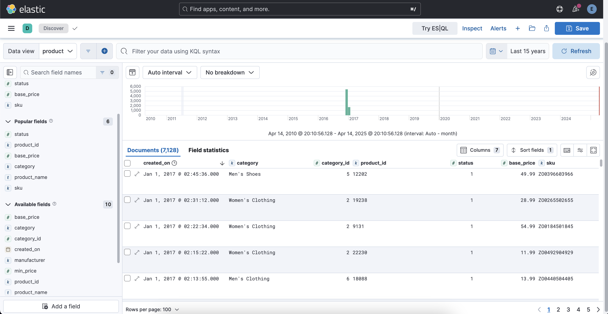

# Product Data

The `product-data` project is a Spring Boot application designed to interact with Elasticsearch. It includes functionality for extracting and processing product and category data from Elasticsearch indices.



## Features

- Extract product and category data from Elasticsearch.
- Index category data with associated product counts.
- Configurable via `application.yml`.

## Prerequisites

- Java
- Maven
- Elasticsearch and kibana instances running and accessible
- `.env` file with the following variables:
  ```
  ELASTICSEARCH_USERNAME=<your-username>
  ELASTICSEARCH_PASSWORD=<your-password>
  ```

## Setup

1. Clone the repository:

   ```bash
   git clone https://github.com/berkesayin/product-data.git
   cd product-data
   ```

2. Create a `.env` file in the root directory and add your Elasticsearch credentials:

   ```bash
   ELASTICSEARCH_USERNAME=your-username
   ELASTICSEARCH_PASSWORD=your-password
   ```

3. Build the project:

   ```bash
   mvn clean install
   ```

4. Run the application:
   ```bash
   mvn spring-boot:run
   ```

## Configuration

The application can be configured via the `application.yml` file. For example:

```yaml
spring:
  application:
    name: product-data

elasticsearch:
  username: ${ELASTICSEARCH_USERNAME}
  password: ${ELASTICSEARCH_PASSWORD}

extract:
  products:
    enabled: true
  categories:
    enabled: false
```

## Usage

- The application will automatically extract and process product data if the `extract.products.enabled` property is set to `true` in `application.yml`.
- Processed category data will be indexed into the `product` index in Elasticsearch.
